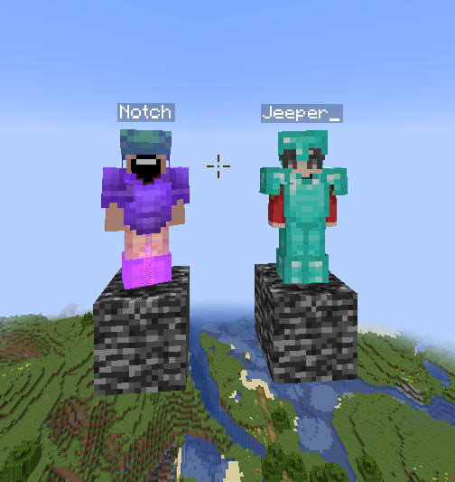

<h1>Description</h1>
A small plugin that I used to test NMS with 
Mojang mappings, using the <code>io.papermc.paperweight.userdev</code>
gradle plugin.

<h1>Usage</h1>
Type <code>/spawnnpc</code> or <code>/spawnnpc<name></code> to spawn an NPC.

The name used will attempt to grab a skin from a Minecraft account, if one exists.
If the name parameter is not provided, the NPC will be a clone of the user.

The NPC may wear armor as well, which will be equipped if the user has any on.

Left Command (<code>/spawnnpc Notch</code>), Right Command (<code>/spawnnpc</code>)
